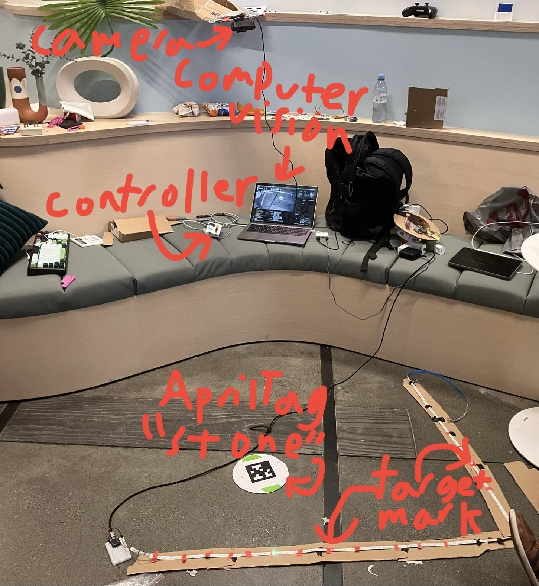
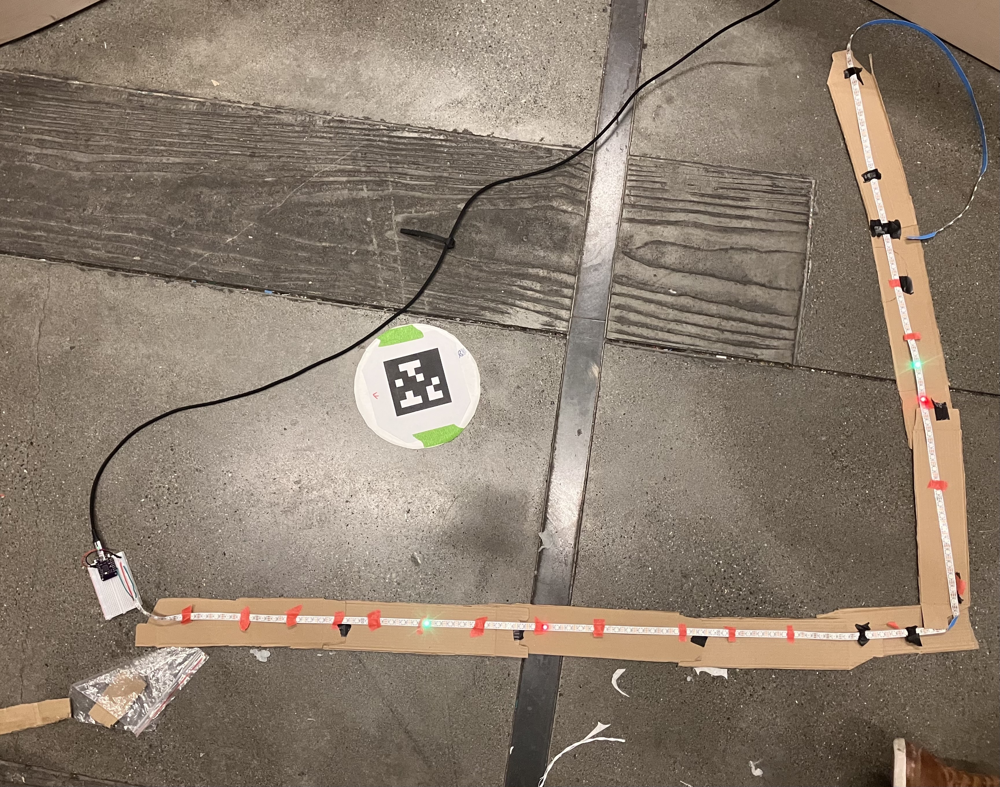
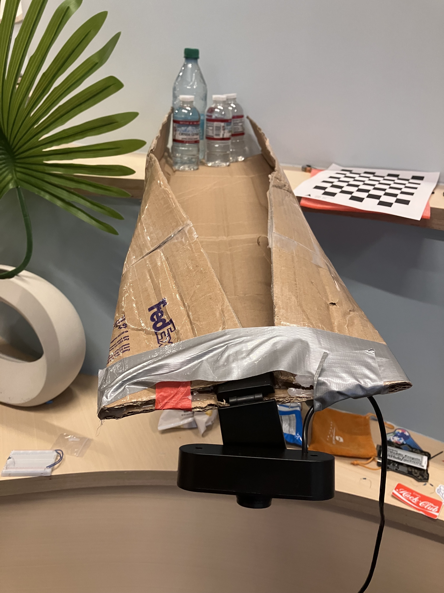
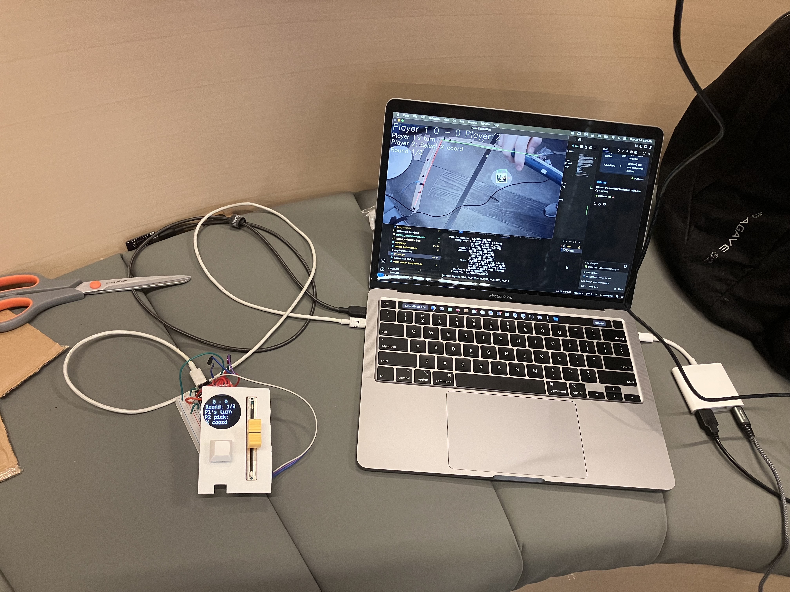
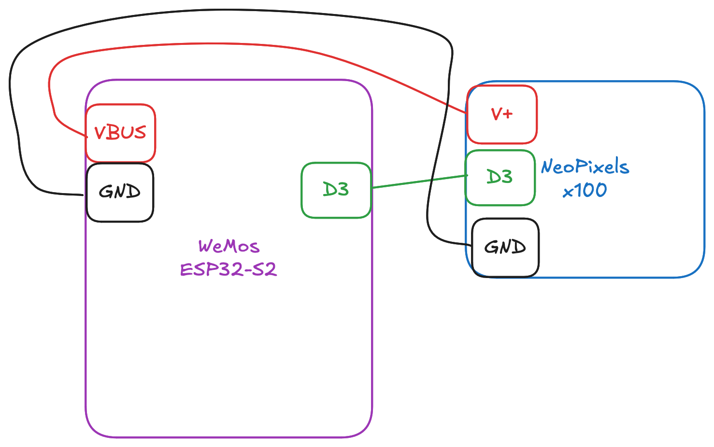
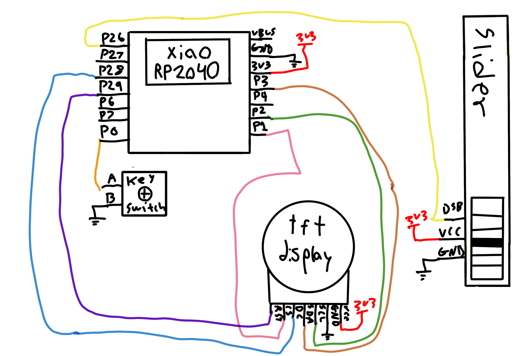

# curling-irl

a project for the Hack Club Undercity hackathon. by @rivques and @Waddle_Penguin.

## Demo Video

[Demo Video](https://www.youtube.com/shorts/2KxNBxlCd_E)

## How to Play
Players take turns challenging each other to shots. On Player 1's turn, Player 2 will choose a target with the slider, then press the button when they are ready. Player 1 will then attempt to make the shot by tossing the AprilTag-decorated "stone" at the target from an agreed-upon distance. Player 1 then presses the button to confirm their shot and is awarded a score. The roles then switch. Each player will take 3 shots in a game.

## Image gallery
||
---|---|---
The field from above.|The camera, with a not-at-all-sketchy cantilever mount.|The laptop + controller.

## Setup
One battery or wall powered ESP32 board should be connected to the NeoPixel strip, running MicroPython, and flashed with `pong-ball/main.py`. Its MAC address should be set in `system-controller/curling.py` around line 36. Another ESP32 board should be flashed with MicroPython and plugged into the back left USBC port (if not using a 4-port Mac, adapt the serial ports accordingly.) The controller, which consists of the XIAO RP2040 connected to a keyswitch and linear potentiometer, should be plugged into the front left USBC port. The webcam should be connected via USB and mounted above the play area. The NeoPixel strip should line up with the red and green lines on the camera visualization.

## Camera calibration
If the playspace is different from the one at GitHub HQ, the camera can be re-calibrated by deleting the `curling_calibration.json` file. This will open a Calibration window on the next run. Place the AprilTag at 3 corners of the play area, pressing 'C' each time. This calibration will be saved for future runs.

## Why We Made This
This project is a pivot from our original idea, making Pong in real life. (Some evidence of this is visible around the repository.) After realizing we weren't going to finish that in time, we took stock of what was working. We had vision, remote control, and our analog slider working and wanted a project that would showcase all of them.

## Bill of Materials
Part|Quantity|link|Notes
---|---|---|---
WeMos ESP32-S2 dev board|2|[link](https://www.wemos.cc/en/latest/s2/s2_mini.html)|
XIAO RP2040|1|[link](https://www.seeedstudio.com/XIAO-RP2040-v1-0-p-5026.html)|
NeoPixel strip|1|[link](https://www.adafruit.com/product/1138)|~120 NeoPixels long
Webcam|1|[link](https://www.bhphotovideo.com/c/product/1811589-REG/hp_53x26aa_abl_320_full_hd_webcam.html/)|
Linear potentiometer|1|[link](https://www.amazon.com/Ximimark-Linear-Potentiometer-Module-Analog/dp/B07HNY7VWC?)|
Keyswitch|1|[link](https://www.amazon.com/BlingKingdom-Replacement-Mechanical-Keyboard-Dustproof/dp/B0DSHTPSL3)|
Keycap|1|[link](https://www.amazon.com/Mechkeeb-Profile-Switches-Keyboard-Replacement/dp/B0BWDQ3NKK)|
Breadboard|2|[link](https://www.amazon.com/Pcs-MCIGICM-Points-Solderless-Breadboard/dp/B07PCJP9DY)|
AprilTag taped to cardstock|1|no link just print it|
USBC cables|2ish|[link](https://www.amazon.com/Duracell-CopperTop-Batteries-All-Purpose-Household/dp/B00000JHQ6)|varies based on setup
AA battery|3|[link](https://www.amazon.com/Duracell-CopperTop-Batteries-All-Purpose-Household/dp/B00000JHQ6)|optional, can use wall power instead

## Wiring Diagram

### lights board

### controller board

